# 2025-2026学年春季学期《游戏音频设计》期末作品说明
## 一、完整章节结构
1. 项目概述
2. 交互音频原型核心设计思路与交互特点
3. 音频系统模块触发逻辑与设计决策
    - 3.1 昼夜时段背景音乐切换系统
    - 3.2 天气环境氛围音联动系统
    - 3.3 音频渐变协程底层控制模块
4. 项目拓展优化思考

## 二、交互音频原型核心设计思路与交互特点
### 1. 核心设计思路
本项目为城市场景天气 - 昼夜交互音频原型，核心目标是实现视听一体化动态音频适配，摒弃传统游戏音频硬切播放的生硬效果，通过平滑音量渐变实现背景音乐、环境氛围音的无缝切换，根据场景状态（昼夜时段、雨雪天气）自动调整音频表现，构建沉浸式动态听觉体验。

整体分为两套独立音频管线：
- 背景音乐管线：绑定昼夜时间系统，不同时段匹配专属 BGM；
- 环境氛围音管线：绑定天气系统，仅在雨雪天气播放对应环境音效，none清空环境音。

### 2. 交互特点
1. **状态驱动式音频交互**
音频播放完全由场景逻辑状态驱动，而非手动开关音频。切换昼夜、切换天气时自动触发对应音频渐变逻辑，玩家通过 UI 按钮切换场景，音频同步联动变化，做到画面、音效、音乐统一响应交互操作。

2. **音量分层联动交互**
两套音频系统存在音量层级约束：当环境氛围音激活（雨雪天气）时，背景音乐自动降低音量，弱化旋律、突出环境氛围感；切回无环境音的none后，背景音乐音量自动恢复，通过音量分层区分主次听觉信息。

3. **无爆音平滑过渡交互**
所有音频切换均使用协程实现线性音量淡入淡出，消除直接切换音频产生的截断杂音；同时增加协程冲突保护，快速连续切换场景时终止上一段渐变流程，避免多层音频叠加失真，保证交互操作下听觉流畅稳定。

4. **数据驱动可配置交互**
所有音频资源不硬编码写死在脚本内，全部通过 ScriptableObject 配置资源挂载，可直接在面板替换背景音乐、雨雪环境音效，无需修改代码即可调整音频内容，拓展性强。

## 三、各音频系统触发逻辑和设计决策说明
### 3.1 昼夜时段背景音乐系统（TimeOfDay 模块）
#### 触发逻辑
1. 场景内置注册表`TimeOfDayRegistry`存储全部时段配置（早晨，下午、黄昏、夜晚），每个`TimeOfDayDefinition`资源挂载对应时段专属背景音乐；
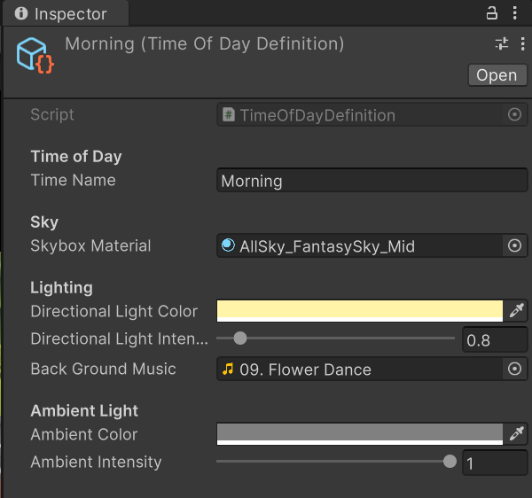
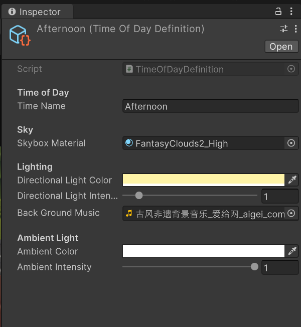
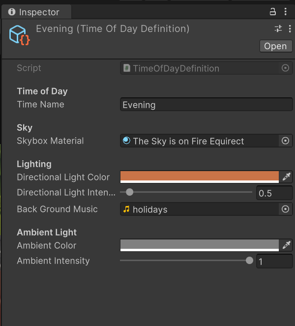
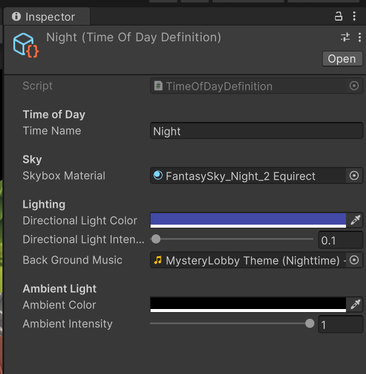

2. UI 按钮调用`SetTimeOfDayByName(string name)`，传入时段名称；
3. 函数从注册表匹配对应时段配置对象，传入`SetTimeOfDay()`核心执行函数；
4. `SetTimeOfDay`内执行：终止所有未完成音频协程，读取新时段背景音乐，天空材质插值过渡，匹配昼夜环境光线变化的自然视觉逻辑，弱化场景切换的割裂感；
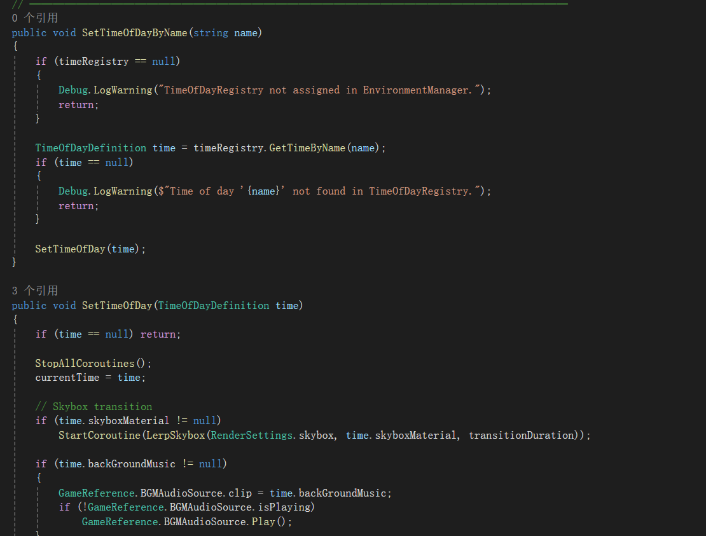

#### 设计决策
1. **切换前统一终止全部运行协程**
防止用户连续快速切换昼夜时段，多组天空盒渐变逻辑同时执行，出现画面闪烁、过渡错乱的问题，保证交互操作稳定可控。

2. **为天空盒材质单独封装插值渐变协程**
昼夜场景核心视觉变化集中在天空光影，线性渐变过渡可以消除材质直接替换带来的生硬跳变，提升场景沉浸感，贴合自然环境光线缓慢变化的真实观感。

3. **每套昼夜配置独立绑定专属背景音乐**
将音乐素材与时段数据统一收纳在 `TimeOfDayDefinition` 配置中，实现数据驱动管理；不同时段匹配风格差异化的背景音乐，通过听觉烘托场景氛围，构建光影、音乐一体化的视听体验。

4. **全局协程终止机制**
每次切换时段先执行`StopAllCoroutines()`，避免连续点击时段按钮时，多段渐变协程同时运行，出现多层音乐重叠、音量混乱。

### 3.2 天气环境氛围音系统（SetWeather 模块）
#### 触发逻辑
1. `WeatherRegistry`注册表统一管理所有天气配置（雨天、雪天、None），`WeatherDefinition`中存储对应环境氛围音；
2. UI 按钮调用切换天气接口，匹配注册表天气数据后进入`SetWeather`；

3. 逻辑分支：
若天气存在环境音（雨 / 雪）：执行环境音淡入协程，同时调用音量控制函数，压低全局背景音乐音量；
若为空（无环境音）：执行环境音淡出，渐变结束后环境音静音，背景音乐音量恢复正常值。

#### 设计决策
1. **切换前执行StopAllCoroutines**
防止短时间连续切换天气时，多组粒子、音频、雾效过渡协程并行执行，引发画面闪烁、多层音效重叠失真，保证高频交互下视听表现稳定。
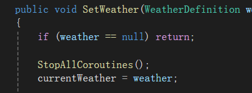

2. **环境音采用AudioCrossFade渐变协程**
摒弃直接 Stop/Play 的硬切方式，依靠音量插值完成新旧环境音无缝过渡，模拟自然天气变化时声响逐步出现、消散的听觉感受，提升沉浸感；同时记录当前音频渐变协程，切换时提前终止上一段渐变，杜绝多层音效叠加。
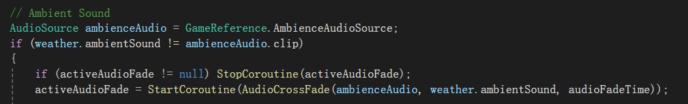

3. **背景音乐动态音量插值（LerpBgmVolume）**
以天气作为听觉主次划分依据：雨雪等氛围场景弱化 BGM，none恢复正常音量，通过音量分层引导玩家听觉注意力，区分场景核心听觉信息；音量采用渐变插值而非瞬间跳变，听觉过渡更柔和自然。
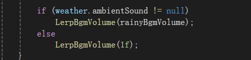

4. **天气分类解耦**
将天气、音频、雾效、粒子特效全部封装在 WeatherDefinition，音频与画面效果统一管理，一套配置同时控制视听双端。

### 3.3 音频渐变协程底层控制模块
#### 3.3.1 AudioCrossFade 音频交叉淡入淡出协程
##### 触发逻辑
该协程在`SetWeather`天气切换函数内被调用，仅当新天气环境音与当前正在播放的环境音素材不一致时触发；调用前会先终止正在运行的音频渐变流程，再启动本协程完成环境音替换过渡。同时该方法为通用工具函数，理论上可复用至背景音乐切换逻辑。

##### 设计决策
1. **采用 “先完整淡出、后淡入新音频” 的单音源过渡方案**
复用同一组 AudioSource 管理全部环境音效，无需多音源并行播放，简化场景音源层级结构，减少资源占用。
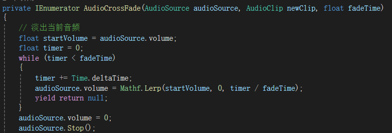
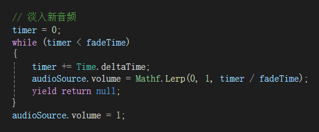

2. **新增随机播放起始点位设计**
环境氛围音多为循环素材，固定从头播放会产生明显重复卡顿感，随机截取音频前段区间启动播放，让循环声响更自然真实。
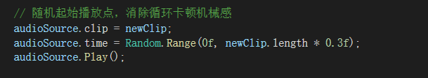

3. **兼容无音频传入分支逻辑**
适配none无环境音的场景需求，一套函数同时支持 “音效替换” 和 “音效关闭” 两种场景，代码复用性更强。

4. **基于统一时长参数控制过渡速度**
全局共用`audioFadeTime`渐变时长，统一项目内所有音频切换的过渡节奏，视听过渡标准统一，便于后期整体调节听觉节奏。

#### 3.3.2 LerpBgmVolume + BgmVolumeSmooth BGM 音量平滑渐变
##### 触发逻辑
在`SetWeather`天气切换逻辑中触发：当配置包含环境氛围音时，调用该方法将背景音乐平滑压低至预设低音量；当切换至无环境音的天气时，调用该方法将背景音乐音量恢复至标准满音量。每次调用前会终止上一段未完成的音量渐变流程，避免多段插值逻辑冲突。

##### 设计决策
1. **双层封装分层设计**
对外提供简洁调用入口，复杂插值逻辑封装在私有协程内，上层业务代码无需关注渐变底层实现，可读性更高。

2. **重复调用时终止上一段渐变**
用户快速反复切换天气时，连续多次修改背景音乐音量，主动停止未完成的插值协程，防止多段音量插值叠加错乱、音量来回抖动。

3. **独立音量渐变逻辑与音频切换解耦**
将环境音素材替换、背景音乐音量调整拆分为两套独立工具函数，二者互不干扰，既可以单独切换环境音效，也能单独调节背景音乐响度，逻辑拆分清晰、拓展性更强。
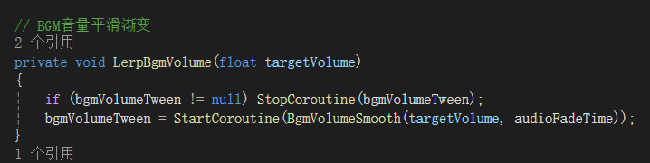
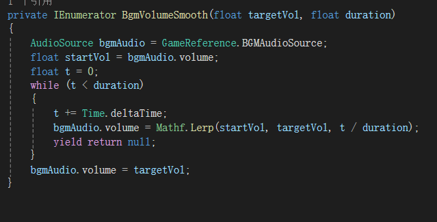

4. **统一复用全局渐变时长参数**
和环境音淡入淡出共用同一套过渡时长配置，保证画面、环境音、背景音乐三者变化节奏同步，视听过渡感受协调统一。

## 四、拓展优化思考
1. 差异化音量控制：当前雨雪共用同一 BGM 压低系数，可在 WeatherDefinition 增加独立音量参数，实现雨雪更低、none适中的分层音量表现；
2. 音频滤镜拓展：雨雪天气可动态修改音源低通滤镜，削弱高频，强化潮湿、安静的听觉氛围；
3. 随机起始播放：环境音循环时随机从音频片段中段开始播放，消除循环片段重复感；
4. 本次受开发时间限制，未优化 UI 视觉表现，后续可增加切换状态文字提示、切换动画，完善交互反馈。